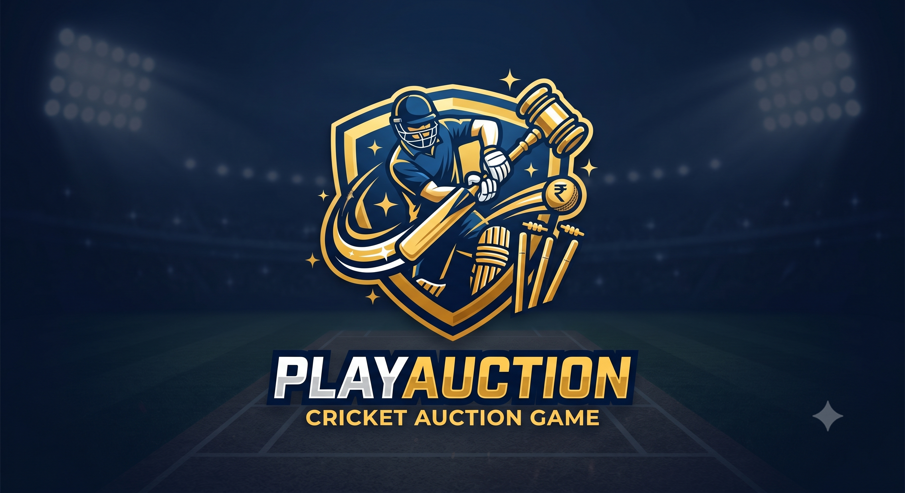
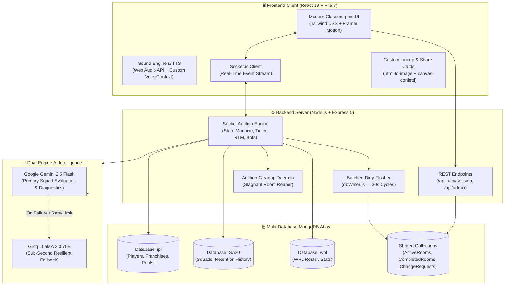

<div align="center">

  

  # 🏏 PlayAuction
  ### Next-Gen Real-Time Multi-League Cricket Auction Platform & Tactical Simulator

  <p align="center">
    <strong>Experience the thrill of the IPL, SA20, and WPL mega-auctions with ultra-low latency real-time bidding, autonomous AI bots, dual-engine squad diagnostics, and interactive post-auction trivia arenas.</strong>
  </p>

  <p align="center">
    <a href="https://drive.google.com/file/d/1DN6u87A_lVMD01ypPb8E3JY_jxVa2wPT/view?usp=sharing">
      
    </a>
  </p>

  <p align="center">
    
    
    
    
    
    
    
    
    
    
  </p>

  <p align="center">
    <a href="#-quick-start">Quick Start</a> •
    <a href="#-key-features">Key Features</a> •
    <a href="#-multi-league-matrix">Multi-League Matrix</a> •
    <a href="#-system-architecture">System Architecture</a> •
    <a href="#-ai-intelligence--diagnostics-engine">AI Diagnostics</a> •
    <a href="#-admin-governance-portal">Admin Portal</a> •
    <a href="#-deployment">Deployment</a>
  </p>

</div>

---

## 🌟 Overview

**PlayAuction** is an end-to-end, multi-tenant digital auction arena engineered to replicate the high-stakes intensity of global professional cricket auctions. Whether drafting legendary Indian Premier League icons, balancing emerging South African talent in the SA20, or strategizing marquee international picks in the Women's Premier League, PlayAuction provides an authentic, synchronized, and competitive environment.

The platform pairs an **ultra-responsive WebSockets bidding engine** with **dual-engine generative AI analytics** (Google Gemini 2.5 Flash + Groq LLaMA 3.3 70B), allowing players to bid against friends, face intelligent autonomous bidding bots, test their cricket trivia in a post-auction quiz, and receive deep tactical diagnostics on their newly assembled squads.

---

## 🚀 Key Features

<table>
  <tr>
    <td width="50%">
      <h3>⚡ Ultra-Low Latency Live Bidding</h3>
      <ul>
        <li>Sub-50ms synchronized bid propagation via <strong>Socket.io</strong>.</li>
        <li>Dynamic countdown timer with anti-snipe buffer resets.</li>
        <li>League-specific bidding ladder with automated increment snapping.</li>
        <li><strong>Right to Match (RTM)</strong> cards with interactive match-or-release mechanics.</li>
        <li>Periodic dirty-room MongoDB flusher to eliminate write bottlenecks.</li>
      </ul>
    </td>
    <td width="50%">
      <h3>🏏 Multi-League Mastery (IPL • SA20 • WPL)</h3>
      <ul>
        <li><strong>IPL:</strong> 15 franchises (10 active + 5 historic legends like Deccan Chargers & Gujarat Lions).</li>
        <li><strong>SA20:</strong> 6 authentic franchises with Rand-denominated purse rules.</li>
        <li><strong>WPL:</strong> 5 franchises with specialized overseas and marquee player constraints.</li>
        <li>Past-season retentions & pre-signed player deductions per team.</li>
      </ul>
    </td>
  </tr>
  <tr>
    <td width="50%">
      <h3>🧠 Dual-Engine AI Squad Diagnostics</h3>
      <ul>
        <li>High-speed tactical evaluation powered by <strong>Gemini 2.5 Flash</strong> with instant <strong>Groq LLaMA 3.3</strong> fallback.</li>
        <li>Squad balance scores, powerplay, middle, and death-overs ratings.</li>
        <li>Algorithmic <strong>Playing 11 selection</strong>, home-pitch suitability scores, and tournament finish projections.</li>
        <li>Player synergy analysis & bench depth replacements.</li>
      </ul>
    </td>
    <td width="50%">
      <h3>🎙️ Audiovisual Stadium Immersion</h3>
      <ul>
        <li>Authentic gavel hammer slams with team-specific celebration audio stings.</li>
        <li>Background cinematic video immersion & ambient stadium audio.</li>
        <li><strong>Text-to-Speech (TTS)</strong> automated auctioneer voice commentary.</li>
        <li>Smooth micro-animations and reactive layout powered by <strong>Framer Motion</strong>.</li>
      </ul>
    </td>
  </tr>
  <tr>
    <td width="50%">
      <h3>🎯 Post-Auction Quiz Arena</h3>
      <ul>
        <li>Real-time multiplayer trivia challenge triggered upon auction completion.</li>
        <li>League-tailored cricket question banks (IPL, SA20, WPL).</li>
        <li>Speed-based scoring algorithm with live leaderboard transitions.</li>
        <li>Animated podium reveals with custom confetti celebrations.</li>
      </ul>
    </td>
    <td width="50%">
      <h3>🛡️ Enterprise Governance & Admin Portal</h3>
      <ul>
        <li>Role-based access control (RBAC): Super Admins & Staging Editors.</li>
        <li><strong>Change Request Protocol:</strong> Propose, review, side-by-side diff, and sign-off on database updates.</li>
        <li>Built-in <strong>MongoDB Explorer</strong> for real-time document inspection.</li>
        <li>Stagnant room reaper service and live staff operational tracking.</li>
      </ul>
    </td>
  </tr>
  <tr>
    <td width="50%">
      <h3>🤖 Autonomous AI Bidding Bots</h3>
      <ul>
        <li>Intelligent bots fill vacant franchises automatically.</li>
        <li>Heuristic-based purse allocation ensuring squads meet minimum role quotas without exhausting funds prematurely.</li>
        <li>Dynamic bidding thresholds based on player reputation, pool tier, and team tactical needs.</li>
      </ul>
    </td>
    <td width="50%">
      <h3>📸 Viral Squad Share Cards</h3>
      <ul>
        <li>One-click exportable high-resolution squad cards rendered with <code>html-to-image</code>.</li>
        <li>Custom lineup builder modal allowing tactical Playing 11 customization before sharing.</li>
        <li>Direct sharing to social platforms with auto-generated hashtags and squad ratings.</li>
      </ul>
    </td>
  </tr>
</table>

---

## 📊 Multi-League Matrix

PlayAuction dynamically configures rules, base prices, currencies, and squad constraints based on the chosen league:

| Parameter | 🇮🇳 IPL (Indian Premier League) | 🇿🇦 SA20 (South Africa T20) | 🇮🇳 WPL (Women's Premier League) |
|---|:---:|:---:|:---:|
| **Franchise Count** | **15** (10 Active + 5 Classic) | **6 Franchises** | **5 Franchises** |
| **Purse Budget** | **₹120.00 Cr** (12,000 Lakhs) | **R39.10 Million** (410 Units) | **₹15.00 Cr** (1,500 Lakhs) |
| **Squad Size Limits** | Min 18 / Max 25 | Max 19 | Min 15 / Max 18 |
| **Overseas Player Cap** | Maximum 8 | Maximum 7 | Maximum 6 |
| **Base Price Tiers** | ₹20L • ₹50L • ₹75L • ₹1Cr • ₹1.5Cr • ₹2Cr | R200K • R400K • R1M • R1.75M+ | ₹10L • ₹20L • ₹30L • ₹40L • ₹50L |
| **Bid Increments** | ₹5L – ₹25L (Slab Adaptive) | R25K / R50K Steps | ₹2.5L / ₹5L / ₹10L Steps |
| **RTM / Retentions** | Supported (Past-Season Logic) | Supported (Retention Deductions) | Supported (Squad Retentions) |
| **Dedicated Database** | `ipl` | `SA20` | `wpl` |

---

## 🏗️ System Architecture



---

## 🧠 AI Intelligence & Diagnostics Engine

At the conclusion of an auction, PlayAuction triggers an automated evaluation pipeline that delivers deep, scouting-grade squad analytics:

```
                          ┌──────────────────────────┐
                          │   Auction Concludes      │
                          └─────────────┬────────────┘
                                        │
                                        ▼
                          ┌──────────────────────────┐
                          │  Extract Final Squads    │
                          │  (Stats, Roles, Purses)  │
                          └─────────────┬────────────┘
                                        │
                                        ▼
                          ┌──────────────────────────┐
                          │ Google Gemini 2.5 Flash  │
                          │ (Structured Zod Parsing) │
                          └─────────────┬────────────┘
                                        │
                   ┌────────────────────┴────────────────────┐
                   │ Success                                 │ Failure / Timeout
                   ▼                                         ▼
   ┌───────────────────────────────┐         ┌───────────────────────────────┐
   │ Complete Diagnostic Report    │         │  Failover to Groq LLaMA 3.3   │
   │ - Overall Rating (0 - 100)    │         │  (Instant Structured Fallback)│
   │ - Phase Breakdown (PP/MID/DTH)│         └───────────────┬───────────────┘
   │ - Optimum Playing 11          │                         │
   │ - Home Ground Suitability     │                         ▼
   │ - Projected Tournament Finish │         ┌───────────────────────────────┐
   └───────────────────────────────┘         │  Deliver Resilient Analytics  │
                                             └───────────────────────────────┘
```

- **Phase Ratings**: Quantifies Batting/Bowling effectiveness across **Powerplay** (Overs 1-6), **Middle Overs** (Overs 7-15), and **Death Overs** (Overs 16-20).
- **Automated XI Selection**: Identifies captaincy material, balances domestic vs. overseas quotas, and ensures bowling depth (minimum 5-6 bowling options).
- **Bench Depth & Contingencies**: Maps primary starters to tactical backups in case of injury or poor form.
- **Home Ground Suitability**: Evaluates how well team attributes match home pitch characteristics (e.g., spin-heavy squads at Chepauk).

---

## 🛡️ Admin Portal & Governance Workflow

PlayAuction includes an enterprise-tier moderation and content staging suite accessible at `/admin/login`:

```text
Draft Change ──> Submit Proposal ──> Side-by-Side Diff ──> Admin Approval ──> Live Mongo Commit
```

1. **Staff Roles**: Super Administrators can onboard **Editors** and **Moderators** with scoped permissions.
2. **Change Request Staging Pipeline**: Edits to player stats, base prices, franchise colors, or rules are submitted as `ChangeRequest` proposals rather than direct database writes.
3. **Side-by-Side Visual Diff**: Built-in diff utility highlights modified attributes before merging into production collections.
4. **MongoDB Explorer**: Live in-browser document querying and collection inspection.
5. **Real-Time Room Management**: Monitor active rooms, force-pause stagnant auctions, or terminate ghost lobbies.

---

## 📂 Project Directory Structure

```text
auctiononline/
├── client/                                # Frontend React application
│   ├── public/
│   │   ├── ipl_logos/                     # IPL franchise crests (15 teams)
│   │   ├── sa20_logos/                    # SA20 franchise crests (6 teams)
│   │   ├── wpl_logos/                     # WPL franchise crests (5 teams)
│   │   ├── game_logos/                    # Vector role & status badges
│   │   ├── flags/                         # National & territory flags
│   │   ├── sounds/                        # Team victory audio stings & gavel slams
│   │   ├── Auction-bg.mp4                 # Immersive background video
│   │   └── Ascension_of_the_Dawn.mp4      # Ambient tournament soundtrack
│   ├── quiz/                              # Trivia question banks (.txt files)
│   └── src/
│       ├── components/
│       │   ├── Admin/                     # MongoExplorer, ChangeRequestManager, StaffManager
│       │   ├── immersive/                 # SplashScreen, ImmersiveWrapper, AnimatedBackground
│       │   ├── AuctionSubComponents.jsx  # BidControls, PlayerBiddingCard, TeamPurseBoard
│       │   ├── CustomLineupModal.jsx     # Tactical Playing 11 builder
│       │   ├── FeedbackWidget.jsx         # Persistent feedback drawer
│       │   ├── GavelSlam.jsx              # 3D hammer animation overlay
│       │   ├── GlobalResultCard.jsx       # Final auction outcome podium
│       │   ├── LeagueNewsMarquee.jsx      # Live ticker banner
│       │   ├── TeamShareCard.jsx          # Social media squad card generator
│       │   ├── Toast.jsx                  # Notifications & alert toasts
│       │   ├── VoiceControls.jsx          # TTS auctioneer controls
│       │   └── WildcardDraftCenter.jsx    # Mid-draft wildcard selections
│       ├── context/
│       │   ├── SessionContext.jsx         # Persistent user & room authentication
│       │   ├── SocketContext.jsx          # Global Socket.io state provider
│       │   └── VoiceContext.jsx           # SpeechSynthesis announcement engine
│       ├── pages/
│       │   ├── Admin/                     # AdminLogin, AdminDashboard
│       │   ├── AuctionPodium.jsx          # Authoritative live auction room
│       │   ├── EvaluationLobby.jsx        # AI calculation transition screen
│       │   ├── Lobby.jsx                  # Room creation, joining & franchise draft
│       │   ├── PublicRooms.jsx            # Filterable public room lobby
│       │   ├── QuizArena.jsx              # Multiplayer post-auction trivia
│       │   └── ResultsReveal.jsx          # Final squad diagnostics & accolades
│       └── utils/
│           ├── bidRules.js                # Incremental bid ladder logic
│           ├── legendConfig.js            # Classic legend rosters & attributes
│           ├── playerUtils.js             # Currency conversions & stat formatters
│           ├── soundEngine.js             # Web Audio API synthesizer & sound router
│           ├── teamLogos.js               # Franchise crest resolver
│           └── teamSlogans.js             # Official team mottos & battle cries
│
└── server/                                # Backend Express + Socket.io server
    ├── config/
    │   └── db.js                          # Multi-tenant MongoDB Atlas connection
    ├── models/
    │   ├── ActiveRoom.js                  # In-flight auction room state
    │   ├── Admin.js                       # Admin credentials & RBAC schema
    │   ├── AuctionRoom.js                 # Archived room records
    │   ├── AuctionTransaction.js          # Authoritative bid ledger
    │   ├── ChangeRequest.js               # Admin governance proposal tracking
    │   ├── CompletedRoom.js               # Finished room archives
    │   ├── Feedback.js                    # User feedback entries
    │   ├── Franchise.js                   # Franchise details, colors, and purse limits
    │   └── Player.js                      # Centralized player document schema
    ├── routes/
    │   ├── api.js                         # Public REST API (players, teams, feedback)
    │   ├── admin.js                       # Protected admin management endpoints
    │   ├── changeRequests.js              # Proposal submission & merge endpoints
    │   └── session.js                     # JWT room session validation
    ├── scripts/
    │   ├── check_ai_status.js             # AI API latency & connectivity verification
    │   ├── createAdmin.js                 # CLI admin user creator
    │   └── seedAdmin.js                   # Default admin bootstrap script
    ├── seed/
    │   ├── importFranchises.js            # Initial franchise catalog seeder
    │   └── importSequentially.js          # Pool-based player sequential seeder
    ├── services/
    │   ├── aiRating.js                    # Algorithmic squad rating calculator
    │   ├── auctionCleanup.js              # Stagnant room cleanup daemon
    │   ├── dbWriter.js                    # Periodic dirty-room write flusher
    │   ├── geminiTeamEvaluation.js        # Gemini & Groq dual-engine evaluator
    │   ├── playerService.js               # Player query & filter service
    │   ├── quizEngine.js                  # Trivia question distributor
    │   ├── sa20History.js                 # SA20 squad retention rules
    │   └── wplHistory.js                  # WPL squad retention rules
    ├── socket/
    │   └── auctionEngine.js               # Core Socket.io auction state machine
    └── utils/
        ├── PlayerCache.js                 # In-memory player fast-lookup cache
        ├── Validation.js                  # Bid & payload sanitization
        ├── adminHelpers.js                # Governance formatting utilities
        ├── bidRules.js                    # Server-authoritative increment rules
        ├── diffHelper.js                  # Deep object diffing engine
        ├── legendRules.js                 # Legend eligibility validators
        ├── playerNormalizer.js            # Schema normalizer across leagues
        ├── quizHelpers.js                 # Quiz score aggregation & leaderboard
        ├── sa20PlayerRules.js             # SA20 quota & overseas validators
        └── teamLogos.js                   # Server-side logo mapping
```

---

## ⚡ Quick Start

### 1. Clone & Navigate
```bash
git clone https://github.com/Venkat262005/PLAYAUCTION---A-MULTI-LEAGUE-AUCTION-GAME.git
cd auctiononline
```

### 2. Backend Configuration & Setup

```bash
cd server
npm install
```

Create a `.env` file in the `server/` directory:

```env
# Server Port
PORT=5001

# MongoDB Atlas Multi-Database Connection String
MONGO_URI=mongodb+srv://<user>:<password>@cluster0.mongodb.net/ipl?retryWrites=true&w=majority

# Security Secret
JWT_SECRET=super_secret_jwt_key_here

# AI Service Keys (At least one recommended)
GOOGLE_API_KEY=your_gemini_api_key_here
GEMINI_API_KEY=your_gemini_api_key_here
GEMINI_MODEL=gemini-2.5-flash
GROQ_API_KEY=your_groq_api_key_here
GROQ_MODEL=llama-3.3-70b-versatile

# Environment
NODE_ENV=development

# Optional: Keep-Alive Server URL for Render Free Tier
# SERVER_URL=https://your-backend.onrender.com
```

Bootstrap initial admin credentials & verify AI connectivity:
```bash
node scripts/seedAdmin.js       # Creates default admin: admin / password123
npm run check-ai                # Verifies connectivity with Gemini & Groq APIs
```

Launch the backend development server:
```bash
npm run dev
```

### 3. Frontend Configuration & Setup

Open a second terminal window:

```bash
cd client
npm install
```

Create a `.env` file in the `client/` directory:

```env
VITE_API_URL=http://localhost:5001
```

> **Note:** The Vite dev server proxies `/api` and `/socket.io` to `http://127.0.0.1:5001` automatically via `vite.config.js`.

Launch the client development server:
```bash
npm run dev
```

The application will be live at **`http://localhost:5173`**! 🎉

---

## 🔑 Environment Variables Reference

| Variable | Scope | Required | Description |
|---|:---:|:---:|---|
| `PORT` | Server | Optional | Port for Express & Socket.io (Defaults to `5001`) |
| `MONGO_URI` | Server | **Yes** | MongoDB connection string (Supports multi-DB switching) |
| `JWT_SECRET` | Server | **Yes** | Secret key for signing admin tokens and room sessions |
| `GOOGLE_API_KEY` | Server | **Yes** | Primary API key for Google Gemini 2.5 Flash squad diagnostics |
| `GROQ_API_KEY` | Server | Recommended | Groq API key for ultra-fast LLaMA-3.3 70B AI inference |
| `GEMINI_MODEL` | Server | Optional | Specific Gemini model identifier (Defaults to `gemini-2.5-flash`) |
| `GROQ_MODEL` | Server | Optional | Specific Groq model identifier (Defaults to `llama-3.3-70b-versatile`) |
| `SERVER_URL` | Server | Optional | Self-ping target URL to avoid Render free-tier idle spin-down |
| `VITE_API_URL` | Client | Optional | Target backend URL for production client builds |

---

## 🚀 Deployment Guide

### Backend (Render.com)
1. Create a new **Web Service** on Render connected to your repository.
2. Set Root Directory to `server`.
3. Set Build Command to `npm install`.
4. Set Start Command to `npm start`.
5. Populate Environment Variables matching `server/.env`.
6. Set `SERVER_URL` to your Render service URL (enables the built-in 14-minute keep-alive ping).

### Frontend (Vercel)
1. Create a new project on Vercel pointing to the repository.
2. Set Root Directory to `client`.
3. Framework Preset: **Vite**.
4. Set Environment Variable: `VITE_API_URL` to your deployed backend URL.
5. The included [`vercel.json`](./client/vercel.json) handles single-page application (SPA) routing rewrites.

---

## 🤝 Contributing

Contributions, issues, and feature requests are welcome!
Feel free to check out the [Issues page](https://github.com/Venkat262005/PLAYAUCTION---A-MULTI-LEAGUE-AUCTION-GAME/issues).

1. Fork the Project
2. Create your Feature Branch (`git checkout -b feature/AmazingFeature`)
3. Commit your Changes (`git commit -m 'Add some AmazingFeature'`)
4. Push to the Branch (`git push origin feature/AmazingFeature`)
5. Open a Pull Request

---

## 📜 License

This project is licensed under the **ISC License**.

---

<div align="center">
  <p>Crafted with ❤️ for cricket fans and tactical strategists worldwide.</p>
  <p>
    <a href="https://drive.google.com/file/d/1DN6u87A_lVMD01ypPb8E3JY_jxVa2wPT/view?usp=sharing"><strong>📺 Watch the Full Project Presentation & Video Demo</strong></a>
  </p>
</div>

